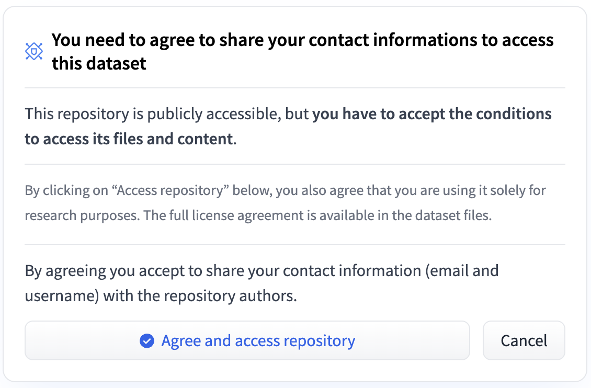

# Data Preparation
The tutorial provides you guidance to download and prepare datasets for the requirements of evaluation. Once you already have those datasets, you can organize the datasets in the structure of [Dataset Structure](#dataset-structure) and ignore the following instructions.

## Downloading Instructions 

* The entry file of downloading is [download.py](download.py). 

* [constants.py](download/constants.py) defines the location of dataset folder, supported dataset names and huggingface API token.

* [utils.py](download/utils.py) implements the process of download and data preparation. 

### Parameters:

* `--datasets` to specify the downloaded datasets, separated with ",", default to select all datasets.

* `--root` to set up data folder.

* `--restore` to skip downloaded datasets.

### Environments
* If you do not install the recommended required packages in [Requiremnets Installation](README.md#requiremnets-installation), install the required packages for data preparation.

    ```bash
    pip install -r requirements_dataset.txt
    ```
* [Optional] To use datasets from huggingface (`imagenet1k` in any languages, `winoground`), you need to:
    * 1. generate huggingface API TOKEN (select the role "read") from [huggingface](https://huggingface.co/settings/tokens) following the [instructions](https://huggingface.co/docs/hub/security-tokens);
    * 2. run the command and add the generated token as git credential: `huggingface-cli login` or modify the [download/constants.py](download/constants.py) file with generated token `>>> _HUGGINGFACE_AUTH_TOKEN = "hf_..."`
    * 3. click the `Agree and access repository` button on dataset pages ([imagenet-1k]("https://huggingface.co/datasets/imagenet-1k") and [winoground]("https://huggingface.co/datasets/facebook/winoground")) to accept the license agreements of the datasets.
        <p align="center">
        
        </p>


* [Optional] To use datasets from kaggle (`fer2013`, `flickr30k`, `flickr30k_cn`, `multi30k`), you need to:
    * 1. generate API token from [kaggle](https://www.kaggle.com/) following the [instructions](https://github.com/Kaggle/kaggle-api#api-credentials).
    * 2. install `unzip` command, for Debian/Ubuntu Linux, use ```sudo apt-get install unzip```; for CentOS/RHEL Linux, use
```yum install unzip```; for macOS, use ```brew install unzip```.

### Multi-datasets Preparation Example:

* To download and prepare `cifar10` and `cifar100` datasets, you can use:

    ```bash
    python download.py --datasets=cifar10,cifar100
    ```

* To have the list of datasets, you can use in Python environment:

    ```python
    >>> from download.constants import _SUPPORTED_DOWNLOAD_DATASETS
    >>> print("\n".join(_SUPPORTED_DOWNLOAD_DATASETS))
    ```

### Full-datasets Preparation Example:

* To download and prepare all supported datasets, you can use:

    ```bash
    python download.py
    ```

### Supplement Instructions

The preparation of the datasets`birdsnap`, `kinetics400`, `kinetics600`, `kinetics700`, `ucf101` are not supported now for some reasons. You can prepare them manually and organize the datasets with the following structure.

### Dataset Structure

The structure of dataset directory is organized as follows:

```
_DEFAULT_DATA_ROOT_DIR
├── birdsnap/val_images
|   └── [CLASSNAMES]/[images]
├── caltech101/caltech101/101_ObjectCategories
|   └── [CLASSNAMES]/[images]
├── cars/stanford_cars
|   ├── cars_test_annos_withlabels.mat
|   └── car_test
|       └── [images]
├── cifar10/cifar-10-batches-py/test_batch
├── cifar100/cifar-100-python/test
├── country211/country211/test
|   └── [CLASSNAMES]/[images]
├── dtd/dtd/dtd
|   ├── labels/test[1-9].txt
|   └── images/[CLASSNAMES]/[images]
├── eurosat/eurosat/2750
|   └── [CLASSNAMES]/[images]
├── fer2013/test
|   └── [CLASSNAMES]/[images]
├── fgvc-aircraft/fgvc-aircraft-2013b/data
|   ├── images_variant_test.txt
|   └── images/[images]
├── flickr30k
|   ├── flickr30k_test_karpathy.txt
|   └── Images/[images]
├── flickr30k-cn
|   ├── flickr30k_test_CNA.txt
|   └── Images/[images]
├── flowers/flowers-102
|   ├── imagelabels.mat
|   └── jpg/[images]
├── food101/food-101
|   ├── meta/classes.txt, labels.txt, test.json, test.txt
|   └── images/[CLASSNAMES]/[images]
├── gtsrb/gtsrb
|   ├── GT-final_test.csv
|   └── GTSRB/Final_Test/Images/[images]
├── imagenet1k/val/[WNIDS]/[images]
├── imagenet-a/[WNIDS]/[images]
├── imagenet-r/[WNIDS]/[images]
├── imagenet-sketch/[WNIDS]/[images]
├── imagenetv2/ImageNetV2-matched-frequency
|   └── [IDS]/[images]
├── kinetics400/val_images/[CLASSNAMES]/[images]
├── kinetics600/val_images/[CLASSNAMES]/[images]
├── kinetics700/val_images/[CLASSNAMES]/[images]
├── mnist/MNIST/raw
|   ├── t10k-images-idx3-ubyte
|   └── t10k-labels-idx1-ubyte
├── mscoco_captions
|   ├── coco_test_karpathy.json
|   └── val2014/[images]
├── mscoco_captions_cn
|   ├── coco_captions_cn_test_1k.txt
|   ├── coco_captions_cn_test_5k.txt
|   └── val2014/[images]
├── multi30k
|   ├── multi30k-en_test.txt
|   ├── multi30k-de_test.txt
|   ├── multi30k-fr_test.txt
|   ├── multi30k-cs_test.txt
|   └── Images/[images]
├── objectnet
|   ├── mappings/folder_to_objectnet_label.json, objectnet_to_imagenet_1k.json, pytorch_to_imagenet_2012_id.json, imagenet_to_label_2012_v2
|   └── images/[CLASSNAMES]/[images]
├── pcam/pcam
|   ├── camelyonpatch_level_2_split_test_x.h5
|   └── camelyonpatch_level_2_split_test_y.h5
├── pets/oxford-iiit-pet
|   ├── annotations/test.txt
|   └── images/[images]
├── renderedsst2/rendered-sst2/test
|   ├── positive/[images]
|   └── negative/[images]
├── resisc45/NWPU-RESISC45
|   └── [CLASSNAMES]/[images]
├── renderedsst2/rendered-sst2/test
|   ├── positive/[images]
|   └── negative/[images]
├── stl10/stl10_binary
|   ├── class_names.txt, fold_indices.txt
|   └── test_X.bin, test_y.bin
├── sun397/SUN397
|   ├── ClassName.txt
|   └── [a-z]/[CLASSNAMES]/[images]
├── ucf101/UCF-101
|   ├── ClassName.txt
|   └── [a-z]/[CLASSNAMES]/[images]
├── voc2007/VOCdevkit/VOC2007
|   ├── ImageSets/Main/[classname]_test.txt
|   ├── Annotations/[id].xml
|   └── JPEGImages/[images]
├── voc2007_multilabel/VOCdevkit/VOC2007
|   ├── ImageSets/Main/[classname]_test.txt
|   └── JPEGImages/[images]
├── winoground/data
|   ├── examples.jsonl
|   └── images/[images]
├── xtd
|   ├── xtd10_[en/fr/jp/pl/tr/de/es/it/ko/ru/zh]_pair.txt
|   └── Images/[images]
└── status.json
```