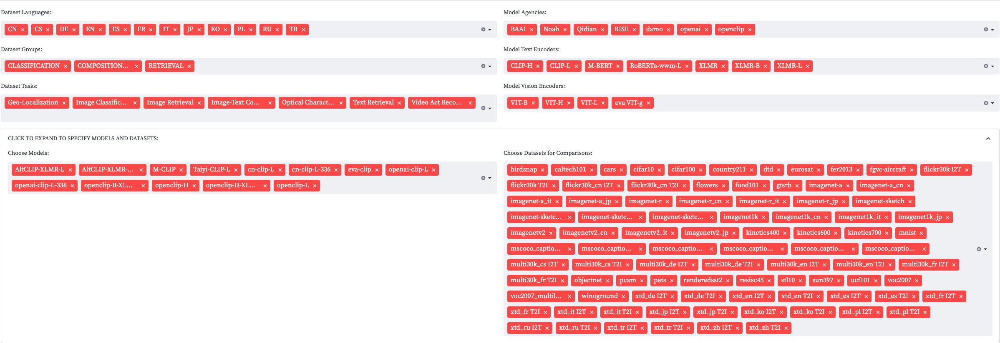
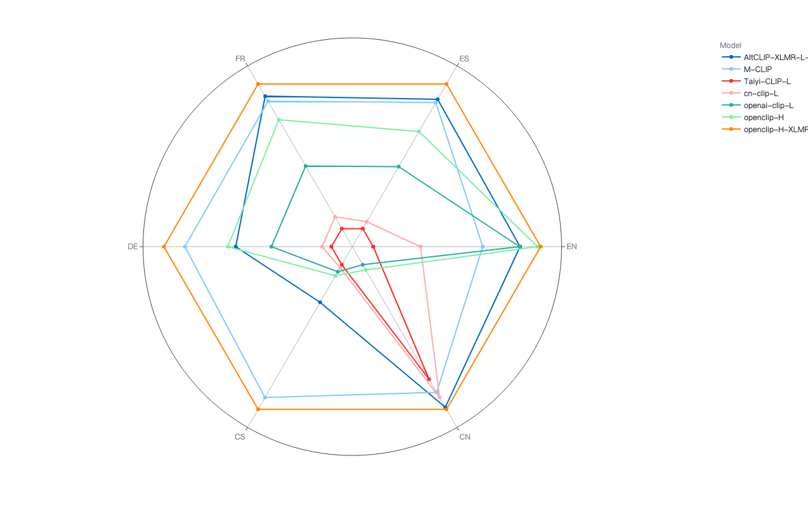
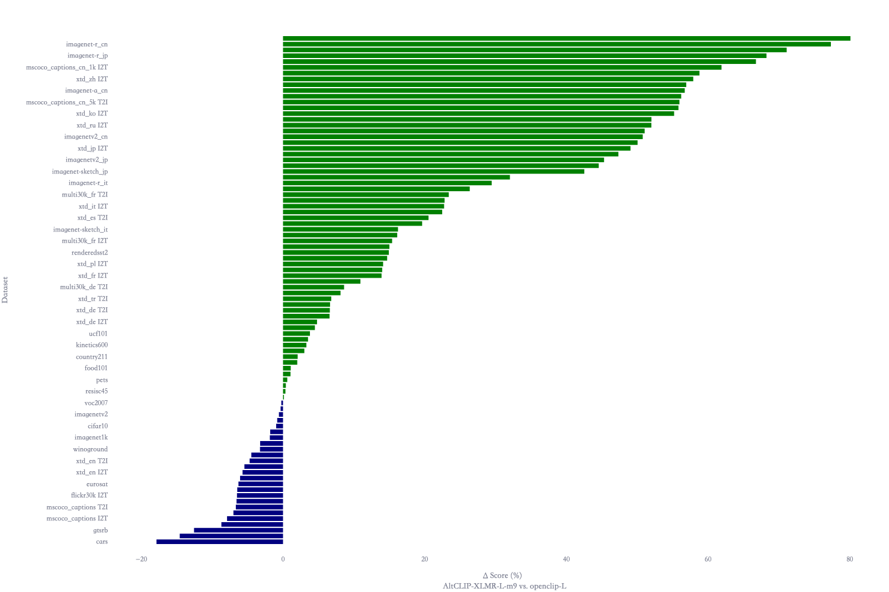

# Visualization
The tutorial provides guidance to visualize the results of `Evaluation` process. With visualization, users can have a better comprehension of performances in multiple dimensions, such as different languages, different tasks, vision encoder sizes, text encoder structure, etc.

The entry file of visualization is [visual.py](visual.py), with the results of evaluation in json files as input, and build a `streamlit` web application. 

## Interface Usage
There are three modes in the web app, namely "Leaderboard", "Model vs. Model" and "Single Dataset"

### Leaderboard

Leaderboard shows the evaluation results of selected models and datasets in the format of radar chart, scatter chart and table.

* How to select datasets and models?
    
    * specify dataset languages, dataset groups or dataset tasks to select datasets
    * specify model agencies, model text encoders, model vision encoders to select models
    * directly specify names to select datasets or models 
    * [Tips] all selections should be satisfied at the same time.
    * [Tips] empty selection is regarded as "select all".



* slide to choose radar chart to show the capabilities of language, group, task or dataset dimension. Below is the radar chart of language capabilities on 6 languages of some built-in models.  



* Scatter chart and table of evaluation results are directly updated according to selected datasets and models.

### Model vs. Model

Model vs. Model mode is designed to compare the performances of two specified models dataset by dataset.

* Use selectbox to select the model pairs to compare

* Datasets can be also specified to remove datasets which is not needed, default option is to select all datasets.

The data in the figure are calculated as the difference between the scores of the selected model 1 and the selected model 2 on each data set, where the green bars are the magnitude of the scores of model 1 over model 2 on a given data set, and the blue bars are the magnitude of the scores of model 2 over model 1 on a given data set

### Single Dataset

Single Dataset is designed to show the performances of all models on all metrics of a single dataset. The dataset is specified by the selectbox. 


## Parameters
* `--json` to specify the input evaluation results with json files, separated by ',', for example, `--json=file1.json,file2.json`.
    * [Tips] wildcard variables is supported, you can use "*", "?":

        ```
        streamlit run visual.py -- --json="outputs/*.json"
        ```
* `--jsonl` to specify the input with a `jsonl` file, in which each line is a json format evaluation result.

* [Tips] To use either `--json` or `--jsonl`.

## Example

Here is an example of visualization.

First, you need to need to install the packages to support visualization:

`pip install -r requirements_visual.txt`

Second, you should prepare evaluation result files. In this example, we take two evaluation result files named `AltCLIP-XLMR-L.json` and `openclip-L.json`.

Then, you can run the visualization module by providing the evaluation file names:

`streamlit run visual.py -- --json=AltCLIP-XLMR-L.json,openclip-L.json`


[Tips] jsonl file input is also supported, you can use `--jsonl=[JSONL_FILE]` to initialize.

The default url of web application is: `http://localhost:8501/`

Here is the snapshot of the visualization webpages.

